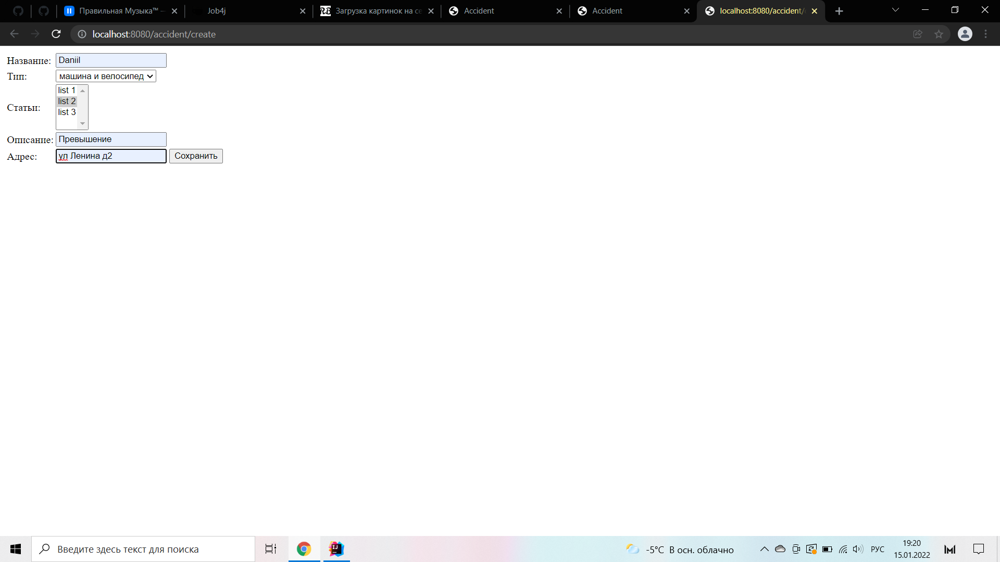

В этом проекте оснавная логика, это укзание нарушение правила дорожного движения
можно указать авто и прописать нарушения.

Применялись следующие технологии для работы этого проекта

1 - Spring Data
2 - Spring ORM
3 - Spring Security
4 - Spring MVC
5 - Spring DI
6 - HTML
7 - Checkstyle
8 - travis
9 - PostgreSQl
10 - Tomcat 9.0.55

